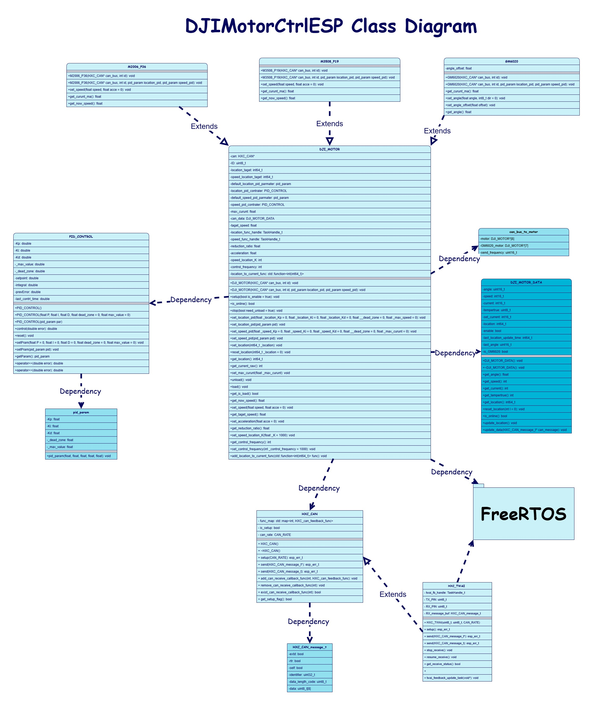
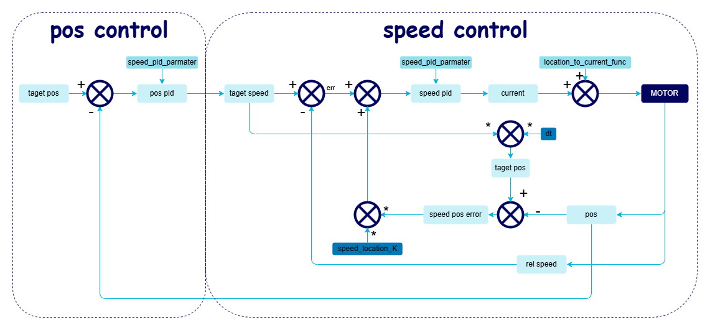

# DJIMotorCtrlESP
重庆邮电大学HXC战队开源


[](https://github.com/qingmeijiupiao/DJIMotorCtrlESP/actions?workflow=Compile+Examples)
[](https://github.com/qingmeijiupiao/DJIMotorCtrlESP/actions/workflows/check-arduino.yml)
[](https://github.com/qingmeijiupiao/DJIMotorCtrlESP/actions/workflows/check-keywords-txt.yml)
## V2.1.0
## 概述

该模块可用于esp32芯片arduino框架的大疆电机控制。
esp32系列只需要外挂一颗CAN收发器，即可实现大疆电机控制。

本文档提供了用于控制大疆电机的DJIMotorCtrlESP模块的详细API说明。

## 类图


## 控制算法
本电机库使用如下图的控制方式

## ESP-IDF兼容
IDFCompatible文件夹中的文件扔到IDF里面并添加编译就能使用了

## 使用流程
创建电机对象->can初始化->设置PID参数(可选)->电机初始化->电机控制
```cpp

HXC_TWAI CAN_BUS(/*TX=*/8, /*RX=*/18);

M3508_P19 motor1(/*CAN_chanel*/&CAN_BUS,/*ID*/1);
GM6020 motor2(/*CAN_chanel*/&CAN_BUS,/*ID*/2);

void setup(){
  CAN_BUS.setup();//在使用电机之前调用can初始化

  //motor1.set_speed_pid(1,0,0,0,1000);//设置位置闭环控制参数
  //motor1.set_location_pid(1,0,0,0,1000);//设置位置闭环控制参数

  motor1.setup();
  motor2.setup();

  motor1.set_speed(1000);//设置电机转速
  motor2.set_angle(180.0);//设置电机转向角度
}
```
## 包含文件

```cpp
//以下3个文件包含在esp32 Arduino SDK中无需手动安装
#include <Arduino.h>
#include <map>
#include <functional>
//ESP32 twai can通信库，本模块附带
#include "HXC_TWAI.hpp"

//#include "HXC_CAN.hpp" 如果需要其他CAN通道需要继承HXC_CAN

//PID控制器文件，本模块附带
#include "PID_CONTROL.hpp"
```


## HXC_CAN

```cpp
hxc_err_t setup(CAN_RATE can_rate);
```
初始化CAN总线通信，必须在使用CAN之前调用此函数。

- **参数**:
  - `can_rate`: CAN速率枚举值，指定CAN通信的速率。

---

### 发送CAN消息

```cpp
hxc_err_t send(HXC_CAN_message_t* message);
```
发送CAN消息。

- **参数**:
  - `message`: 指向一个`HXC_CAN_message_t`结构体的指针，包含要发送的CAN消息信息。

---

```cpp
hxc_err_t send(HXC_CAN_message_t message);
```
发送CAN消息。

- **参数**:
  - `message`: 一个`HXC_CAN_message_t`结构体，包含要发送的CAN消息信息。

---

### 添加CAN消息接收回调函数

```cpp
void add_can_receive_callback_func(int addr, HXC_can_feedback_func func);
```
添加用户自定义的CAN消息接收回调函数，用于处理特定地址的CAN消息。

- **参数**:
  - `addr`: 要处理的消息的地址。
  - `func`: 回调函数，当收到对应地址的消息时执行，可以是lambda表达式、函数指针、静态类成员函数或`std::function`。


#### 注册CAN回调函数示例
```cpp
#include "HXC_TWAI.hpp"

HXC_TWAI CAN_BUS(/*TX=*/8, /*RX=*/18);

void func2(HXC_CAN_message_t* can_message){
    //打印收到的数据
    for(int i=0;i<can_message->data_length_code;i++){
      Serial.print(can_message->data[i],HEX);
      Serial.print(" ");
    }
    Serial.println();
}

void setup(){
  CAN_BUS.setup();//必须初始化CAN总线才可以使用
  CAN_BUS.add_can_receive_callback_func(0x255,
    [](twai_message_t* can_message){//lamda表达式
      //打印收到的数据
      for(int i=0;i<can_message->data_length_code;i++){
        Serial.print(can_message->data[i],HEX);
        Serial.print(" ");
      }
      Serial.println();
    }
  );//收到0x255地址消息时自动调用这个lamda表达式

  CAN_BUS.add_can_receive_callback_func(0x245,func2);//收到0x245地址消息时自动调用func2
}
```
---

### 移除CAN消息接收回调函数

```cpp
void remove_can_receive_callback_func(int addr);
```
移除之前添加的CAN消息接收回调函数。

- **参数**:
  - `addr`: 要移除的消息的地址。

---

### 判断CAN消息接收回调函数是否存在

```cpp
bool exist_can_receive_callback_func(int addr);
```
判断是否为特定地址的消息设置了接收回调函数。

- **参数**:
  - `addr`: 要检查的消息地址。
- **返回值**:
  - `true`: 如果为该地址设置了回调函数。
  - `false`: 如果没有为该地址设置回调函数。

---


## DJI_MOTOR

电机基类，也可用于没有减速箱的M2006和M3508。

- **构造函数**:
  - `DJI_MOTOR(HXC_CAN* can_bus, int id)`: 构造函数，初始化电机ID和CAN总线。
    - **参数**:
      - `HXC_CAN* can_bus` - 指向CAN总线对象的指针。
      - `int id` - 电机的ID（1-8）。
  - `DJI_MOTOR(HXC_CAN* can_bus, int id, pid_param location_pid, pid_param speed_pid)`: 构造函数，初始化电机ID、CAN总线和PID参数。
    - **参数**:
      - `HXC_CAN* can_bus` - 指向CAN总线对象的指针。
      - `int id` - 电机的ID（1-8）。
      - `pid_param location_pid` - 位置PID参数。
      - `pid_param speed_pid` - 速度PID参数。

- **成员函数**:
  - `void setup(bool is_enable = true)`: 初始化电机，位置闭环，使能。
    - **参数**: `bool is_enable` - 是否使能，默认为`true`。
  - `bool is_online()`: 判断电机是否在线。
    - **返回值**: `bool` - 如果电机在线返回`true`，否则返回`false`。
  - `void stop(bool need_unload = true)`: 停止电机。
    - **参数**: `bool need_unload` - 是否需要卸载使能，默认为`true`。
  - `void set_location_pid(float _location_Kp = 0, float _location_Ki = 0, float _location_Kd = 0, float __dead_zone = 0, float _max_speed = 0)`: 设置位置闭环控制参数。
    - **参数**:
      - `float _location_Kp` - PID的比例系数。
      - `float _location_Ki` - PID的积分系数。
      - `float _location_Kd` - PID的微分系数。
      - `float __dead_zone` - 死区。
      - `float _max_speed` - 最大速度。
  - `void set_speed_pid(float _speed_Kp = 0, float _speed_Ki = 0, float _speed_Kd = 0, float __dead_zone = 0, float _max_curunt = 0)`: 设置速度闭环控制参数。
    - **参数**:
      - `float _speed_Kp` - PID的比例系数。
      - `float _speed_Ki` - PID的积分系数。
      - `float _speed_Kd` - PID的微分系数。
      - `float __dead_zone` - 死区。
      - `float _max_curunt` - 最大电流。
  - `void set_location(int64_t _location)`: 设置多圈目标位置。
    - **参数**: `int64_t _location` - 目标位置值。
  - `void reset_location(int64_t _location = 0)`: 重置当前多圈位置。
    - **参数**: `int64_t _location` - 重置到的位置值，默认为0。
  - `int64_t get_location()`: 获取当前多圈位置。
    - **返回值**: `int64_t` - 当前位置值。
  - `int get_current_raw()`: 获取当前电流原始值。
    - **返回值**: `int` - 电流原始值。
  - `void set_max_curunt(float _max_curunt)`: 设置最大电流。
    - **参数**: `float _max_curunt` - 最大电流值。
  - `void unload()`: 卸载使能。
  - `void load()`: 使能。
  - `bool get_is_load()`: 获取是否使能。
    - **返回值**: `bool` - 如果电机使能返回`true`，否则返回`false`。
  - `float get_now_speed()`: 获取当前速度。
    - **返回值**: `float` - 当前速度值。
  - `void set_speed(float speed, float acce = 0)`: 设置目标速度。
    - **参数**:
      - `float speed` - 目标速度值。
      - `float acce` - 加速度，默认为0。
  - `float get_taget_speed()`: 获取转子目标速度。
    - **返回值**: `float` - 目标速度值。
  - `void set_acceleration(float acce = 0)`: 设置电机加速度。
    - **参数**: `float acce` - 加速度，默认为0。
  - `void set_speed_location_K(float _K)`: 设置速度环位置误差系数。
    - **参数**: `float _K` - 速度环位置误差系数。
  - `void add_location_to_current_func(std::function<int(int64_t)> func)`: 添加位置到电流映射函数。
    - **参数**: `std::function<int(int64_t)> func` - 映射函数。
  - `void set_control_frequency(int _control_frequency = 1000)`: 设置闭环控制频率。
    - **参数**: `int _control_frequency` - 闭环控制频率，默认为1000Hz。
  - `int get_control_frequency()`: 获取闭环控制频率。
    - **返回值**: `int` - 闭环控制频率。

## M3508_P19

3508电机类，继承自DJI_MOTOR基类，**与基类相同的API不重复列出**


- **构造函数**:
  - `M3508_P19(HXC_CAN* can_bus, int id)`: 构造函数，初始化电机ID和CAN总线。
    - **参数**:
      - `HXC_CAN* can_bus` - 指向CAN总线对象的指针。
      - `int id` - 电机的ID（1-8）。
  - `M3508_P19(HXC_CAN* can_bus, int id, pid_param location_pid, pid_param speed_pid)`: 构造函数，初始化电机ID、CAN总线和PID参数。
    - **参数**:
      - `HXC_CAN* can_bus` - 指向CAN总线对象的指针。
      - `int id` - 电机的ID（1-8）。
      - `pid_param location_pid` - 位置PID参数。
      - `pid_param speed_pid` - 速度PID参数。

- **成员函数**:
  - `void set_speed(float speed, float acce = 0)`: 设置减速箱输出速度。
    - **参数**:
      - `float speed` - 目标速度值。
      - `float acce` - 加速度，默认为0。
  - `float get_curunt_ma()`: 获取当前电流，单位mA。
    - **返回值**: `float` - 当前电流值，单位mA。
  - `float get_now_speed()`: 获取减速箱输出速度。
    - **返回值**: `float` - 减速箱输出速度值。

## M2006_P36

2006电机类，继承自DJI_MOTOR基类，**与基类相同的API不重复列出**

- **构造函数**:
  - `M2006_P36(HXC_CAN* can_bus, int id)`: 构造函数，初始化电机ID和CAN总线。
    - **参数**:
      - `HXC_CAN* can_bus` - 指向CAN总线对象的指针。
      - `int id` - 电机的ID（1-8）。
  - `M2006_P36(HXC_CAN* can_bus, int id, pid_param location_pid, pid_param speed_pid)`: 构造函数，初始化电机ID、CAN总线和PID参数。
    - **参数**:
      - `HXC_CAN* can_bus` - 指向CAN总线对象的指针。
      - `int id` - 电机的ID（1-8）。
      - `pid_param location_pid` - 位置PID参数。
      - `pid_param speed_pid` - 速度PID参数。

- **成员函数**:
  - `void set_speed(float speed, float acce = 0)`: 设置减速箱输出速度。
    - **参数**:
      - `float speed` - 目标速度值。
      - `float acce` - 加速度，默认为0。
  - `float get_curunt_ma()`: 获取当前电流，单位mA。
    - **返回值**: `float` - 当前电流值，单位mA。
  - `float get_now_speed()`: 获取减速箱输出速度。
    - **返回值**: `float` - 减速箱输出速度值。

## GM6020

GM6020电机类，继承自DJI_MOTOR基类，**与基类相同的API不重复列出**


- **构造函数**:
  - `GM6020(HXC_CAN* can_bus, int id)`: 构造函数，初始化
电机ID和CAN总线。
    - **参数**:
      - `HXC_CAN* can_bus` - 指向CAN总线对象的指针。
      - `int id` - 电机的ID（1-8）。
  - `GM6020(HXC_CAN* can_bus, int id, pid_param location_pid, pid_param speed_pid)`: 构造函数，初始化电机ID、CAN总线和PID参数。
    - **参数**:
      - `HXC_CAN* can_bus` - 指向CAN总线对象的指针。
      - `int id` - 电机的ID（1-8）。
      - `pid_param location_pid` - 位置PID参数。
      - `pid_param speed_pid` - 速度PID参数。

- **成员函数**:
  - `float get_curunt_ma()`: 获取实际电流，单位mA。
    - **返回值**: `float` - 当前电流值，单位mA。
  - `void set_angle(float angle, int8_t dir = 0)`: 设置转向角度。
    - **参数**:
      - `float angle` - 目标角度值。
      - `int8_t dir` - 旋转方向，默认为0（最近方向）。
  - `void set_angle_offset(float offset)`: 设置角度偏移量。
    - **参数**: `float offset` - 角度偏移量。
  - `float get_angle()`: 获取角度。
    - **返回值**: `float` - 当前角度值。

## 内部调用的类和函数

在外部调用以下的类和函数是不安全的。

### DJI_MOTOR_DATA

电调接收数据相关类，用户无需创建对象。

- **成员函数**:
  - `float get_angle()`: 返回电机的角度。
    - **返回值**: `float` - 角度值，范围0-360度。
  - `int get_speed()`: 返回电机的转速。
    - **返回值**: `int` - 转速值，单位RPM。
  - `int get_current()`: 返回电机的电流。
    - **返回值**: `int` - 电流值。
  - `int get_tempertrue()`: 获取电机的温度。
    - **返回值**: `int` - 温度值，单位摄氏度。
  - `int64_t get_location()`: 获取电机的多圈位置。
    - **返回值**: `int64_t` - 位置值。
  - `void reset_location(int l = 0)`: 重置电机的多圈位置。
    - **参数**: `int l` - 重置到的位置值，默认为0。
  - `bool is_online()`: 判断电机是否在线。
    - **返回值**: `bool` - 如果电机在线返回`true`，否则返回`false`。


### can_bus_and_motor

`can_bus_and_motor` 结构体用于维护CAN总线和电机对象之间的映射关系，以及发送频率的设置。这个结构体在内部使用，用户无需直接操作。

- **成员变量**:
  - `HXC_CAN* can_bus`: 指向CAN总线对象的指针，表示与电机连接的CAN总线。
  - `DJI_MOTOR* motor[8]`: 包含8个指向`DJI_MOTOR`对象的指针，用于存储与同一CAN总线连接的8个电机对象。
  - `DJI_MOTOR* GM6020_motor[7]`: 包含7个指向`DJI_MOTOR`对象的指针，特别用于存储GM6020型号电机的对象，因为GM6020电机可能需要特殊的处理。
  - `uint16_t send_frequency`: 发送频率，单位为赫兹（Hz），默认值为1000Hz，表示该CAN总线上电流发送的频率。


## 示例
```cpp
#include "DJIMotorCtrlESP.hpp"
#include "HXC_TWAI.hpp"
/* 速度控制 */


HXC_TWAI CAN_BUS(/*TX=*/8, /*RX=*/18);

// 3508电机
M3508_P19 MOTOR1(&CAN_BUS,/*ID=*/1);

// 2006电机
M2006_P19 MOTOR2(&CAN_BUS,/*ID=*/2);

// GM6020电机
GM6020 MOTOR3(&CAN_BUS,/*ID=*/3);

void setup()
{
  // CAN初始化
  CAN_BUS.setup();
  
  MOTOR1.setup();
  MOTOR2.setup();
  MOTOR3.setup();
}
void loop()
{
  MOTOR1.set_speed(200);
  MOTOR2.set_speed(200);
  MOTOR3.set_speed(200);
  delay(5000);
  MOTOR1.set_speed(0);
  MOTOR2.set_speed(0);
  MOTOR3.set_speed(0);
  delay(5000);

}
```